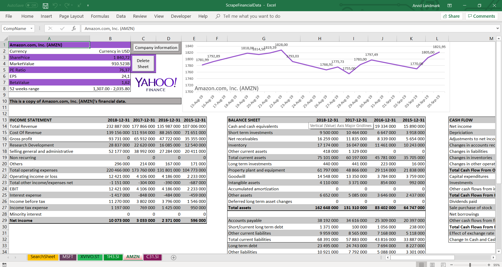

Welcome to my Financial statements scraper project!

This is a Visual Basic for Applications project that enables the user to retrieve financial statements.
A good use of this program is to create a comparable analysis.

Simply enter the ticker of a desired company and hit the GetData!-button.
The financial statements are generated, among with recent stock price and company information.  

Enjoy!

All data is gathered from https://finance.yahoo.com/.

Created by Arvid Landmark, May 2019.

Preview:

